# Sort Algorithm

## 1. Bubble Sort 
    인접한 두 원소를 비교하여 자리를 교환하는 방식
    수행시간 : O(N*N)   (N : 주어진 배열의 크기)
    
#### 정렬 과정
##### 1) 주어진 배열
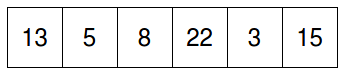

##### 2) array[0]과 array[1] 비교

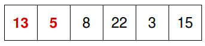

##### 3) 13이 5보다 크므로 교체
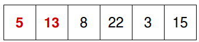

##### 4) array[1]과 array[2] 비교
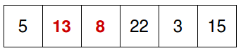

##### 5) 8이 13보다 작으므로 교체
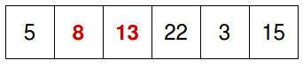

##### 6) 2) ~ 3) 과정을 반복한 결과
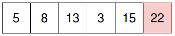

##### 7) for문을 한번 더 돌았을 때 결과
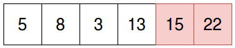

##### 8) 결과
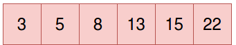

## 2. Merge Sort
     Divide & Conquer를 이용하여 정렬하는 방식
     수행시간 : O(N*log(N))
     
### Divide & Conquer
    Divide : 큰 문제를 풀기 쉽게 하기 위해 작은 문제로 나누는 단계
    Conquer : 작은 문제를 해결하여 해를 구하는 단계, 보통 재귀적으로 구함
    Merge :  작은 문제들의 해를 합치는 단계 
    
#### 정렬 과정    
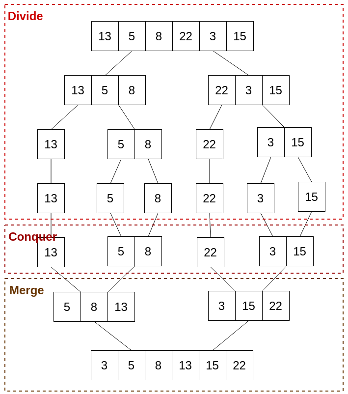

## 3. Quick Sort
    데이터를 두 부분으로 분할하고 분할한 데이터 내에서 정렬을 함. 각 분할된 부분을 재귀적으로 정렬.
    수행시간 : O(N*log(N)
    
#### 정렬 과정
##### 1) 주어진 배열에서 pivot을 정함
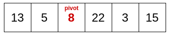

##### 2) pivot보다 작은 값은 pivot의 앞으로 큰 값은 pivot의 뒤로 정렬한 뒤 pivot을 사이에 위치하도록 함 

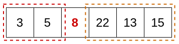

##### 3) 처음 정한 pivot보다 작은 값들을 다시 재귀적으로 정렬한다. 5를 새로운 pivot으로 설정한뒤 pivot을 기준으로 정렬
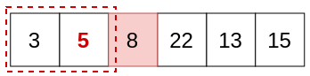

##### 4) 처음 정한 pivot보다 큰 값들을 다시 재귀적으로 정렬한다. 13를 새로운 pivot으로 설정한뒤 pivot을 기준으로 정렬
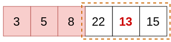

##### 5) 결과
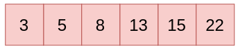

## 4. Heap Sort
    자료구조 Heap을 이용하여 데이터를 정렬함.
    수행시간 : O(N*log(N)

### Heap
    완전 이진트리(Complete Binary Tree)로서 성질을 만족함
    최소힙 : 모든 부모 노드의 값이 자식 노드보다 작은 힙
    최대힙 : 모든 부모 노드의 값이 자식노드보다 큰 힙
    
#### 최소힙
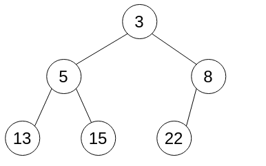

#### 정렬 과정

##### 1) Root 노드를 배열에 입력
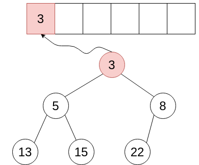

##### 2) 가장 마지막 노드를 Root 노드 자리에 옮겨놓은 뒤 다시 완벽한 힙을 만듦
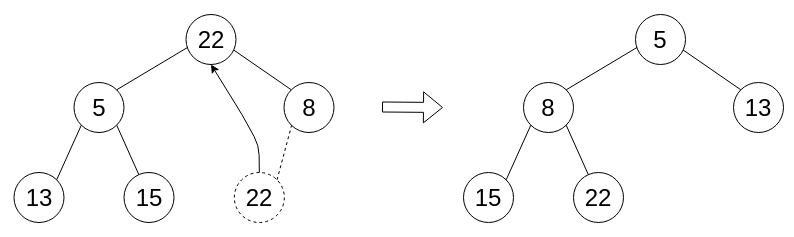

##### 3) Root 노드를 배열에 입력
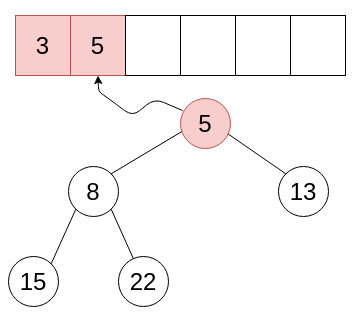

##### 4) 위의 과정을 힙의 원소가 남아있지 않을 때까지 반복
